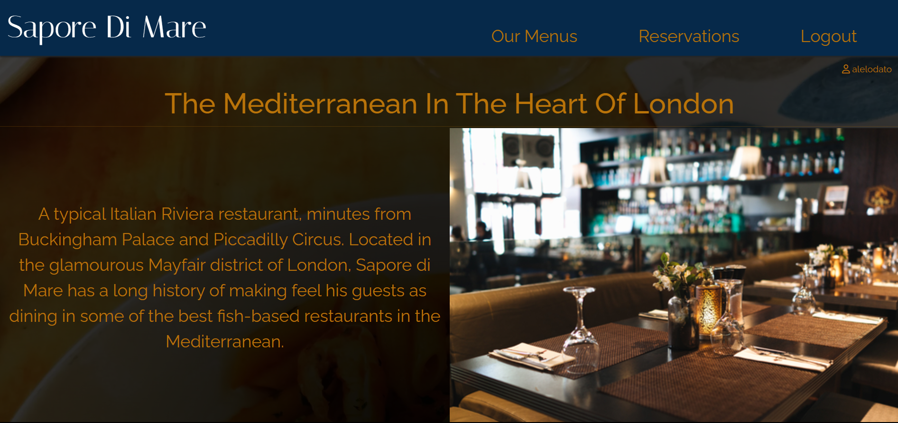
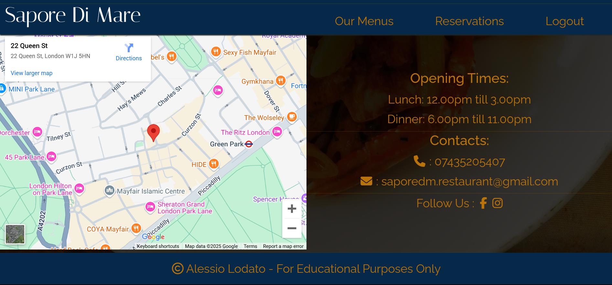
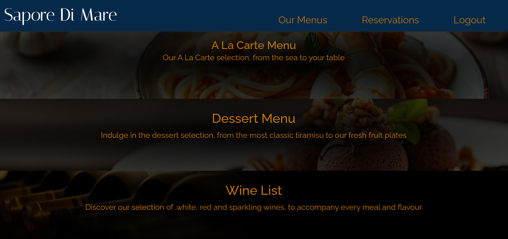
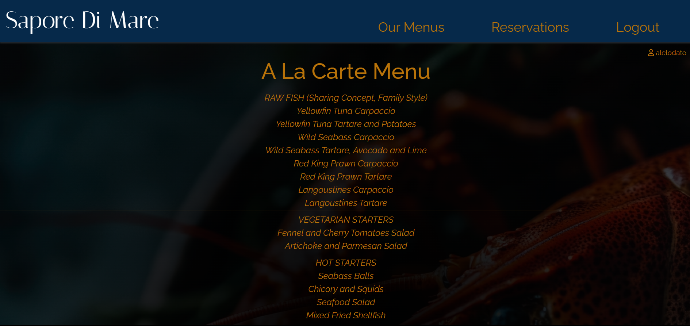
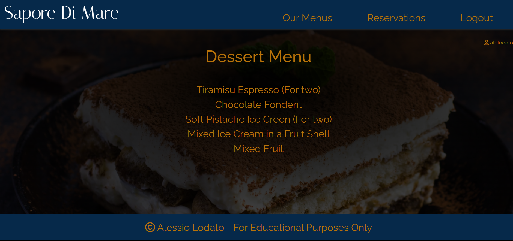
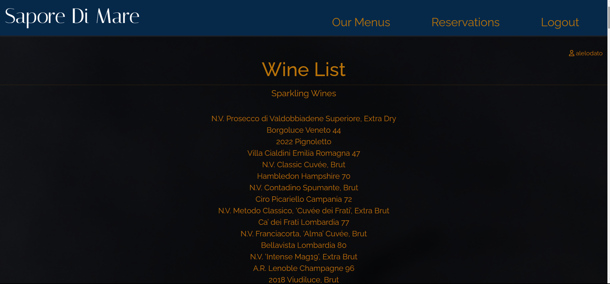
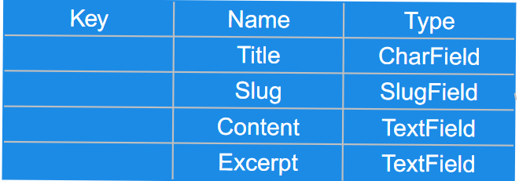

# Sapore Di Mare

Portfolio 4 project as part of the Diploma in Full Stack Software Development by Code Institute.
___

In this project i created the website for a fictional restaurant called Sapore Di Mare. 

Link to live site - [https://sapore-di-mare-0503ed908911.herokuapp.com/](https://sapore-di-mare-0503ed908911.herokuapp.com/)

### Strategy
The overall approach was to build a full stack application using the Django framework linked to a PostgreSQL database. PostgreSQL is a popular and adaptable relational database management system and Django is a flexible framework which easily integrates API's, allowing for a streamlined development cycle. Both are open source and well supported allowing for easy maintenance, future development and customisation. Bootstrap 5 was to be used at the front end to speed up the design process.

The site was designed using an Agile approach. Epics and user stories were collected, added to a [kanban board](https://github.com/users/alelodato/projects/4/views/1) in the project [Githib repository](https://github.com/alelodato/sapore-di-mare) and prioritised according to the MOSCOW system. MOSCOW organises stories and features into 'Must have', 'Should have', 'Could have', 'Won't have' categories. This allows Agile developers to prioritise which parts of the programme to create first. After a fixed period of time the development cycle ends and the project is reviewed. features may be recategorised and additional user stories added throughout based on testing and feedback received.

### Scope

The below epics and user stories were collected. Epics were broken down into user stories, added to the project [kanban board](https://github.com/users/alelodato/projects/4/views/1).

#### Epics

- Creation of a full stack web application to manage restaurant reservations using Django.

- Staff should have full CRUD control over all reservations via the Admin panel.

- Customers should have full CRUD control over their reservations via the front end of the site.

- The site should display a menu.

- The site front end should support the overall marketing strategy of the business, being appealing and easy to navigate.

#### Must have

Must have features are features without which the project will not work.

- [Staff can make reservations on behalf of customers](https://github.com/users/alelodato/projects/4/views/1?pane=issue&itemId=92067107&issue=alelodato%7Csapore-di-mare%7C4)

- [Staff can edit reservations on behalf of customers](https://github.com/users/alelodato/projects/4/views/1?pane=issue&itemId=92067107&issue=alelodato%7Csapore-di-mare%7C4)

- [Staff can delete reservations on behalf of customers](https://github.com/users/alelodato/projects/4/views/1?pane=issue&itemId=92067107&issue=alelodato%7Csapore-di-mare%7C4)

- [Staff should have accounts with enhanced access so they have CRUD access to reservation, user and menu databases. These accounts should be password protected for reasons of data security and to prevent malicious use.](https://github.com/users/alelodato/projects/4/views/1?pane=issue&itemId=92068608&issue=alelodato%7Csapore-di-mare%7C7)

- [Customers should be able to create an account so their data is protected with a password](https://github.com/users/alelodato/projects/4/views/1?pane=issue&itemId=92066280&issue=alelodato%7Csapore-di-mare%7C2)

- [Customers can make reservations online.](https://github.com/users/alelodato/projects/4/views/1?pane=issue&itemId=92066751&issue=alelodato%7Csapore-di-mare%7C3)

- [Customers can edit reservations online.](https://github.com/users/alelodato/projects/4/views/1?pane=issue&itemId=92066751&issue=alelodato%7Csapore-di-mare%7C3)

- [Customers can delete reservations online.](https://github.com/users/alelodato/projects/4/views/1?pane=issue&itemId=92066751&issue=alelodato%7Csapore-di-mare%7C3)

- [The site should prevent users making reservations in the past.](https://github.com/users/alelodato/projects/4/views/1?pane=issue&itemId=92066751&issue=alelodato%7Csapore-di-mare%7C3)

- [The front end of the programme should be designed to allow for intuitive use.](https://github.com/users/alelodato/projects/4/views/1?pane=issue&itemId=92067977&issue=alelodato%7Csapore-di-mare%7C6)

#### Should have

Features not essential to the functioning of the project, but will add significant value to the project.

-[Restaurant staff can create, edit and delete restaurant menus.](https://github.com/users/alelodato/projects/4/views/1?pane=issue&itemId=94316099&issue=alelodato%7Csapore-di-mare%7C11)

- [The site should tell users if they are logged in. The message advising them they are not should link to the login page.](https://github.com/users/alelodato/projects/4/views/1?pane=issue&itemId=92066280&issue=alelodato%7Csapore-di-mare%7C2)

- [The site should be able to display the restaurant menu.](https://github.com/users/alelodato/projects/4/views/1?pane=issue&itemId=92067977&issue=alelodato%7Csapore-di-mare%7C6)

- [Menu should be visible to customers without a login.](https://github.com/users/alelodato/projects/4/views/1?pane=issue&itemId=92067977&issue=alelodato%7Csapore-di-mare%7C6)

-[The site should have pop up messages for the user to confirm if they logged in logged out or reserve, edit and cancel a reservation successfully](https://github.com/users/alelodato/projects/4/views/1?pane=issue&itemId=92066751&issue=alelodato%7Csapore-di-mare%7C3)

- [Pop up messages should stand out more from the background](https://github.com/users/alelodato/projects/4/views/1?pane=issue&itemId=92066751&issue=alelodato%7Csapore-di-mare%7C3)

#### Could have

Features which may be useful, but will not add as much value to the site. Due to time constraints these have not been added to the project so have been marked as won't have on the kanban board.

- [Customers can submit special queries and feedbacks via the website.](https://github.com/users/alelodato/projects/4?pane=issue&itemId=94316096&issue=alelodato%7Csapore-di-mare%7C5)

- [A system for matching reservations with tables.](https://github.com/users/alelodato/projects/4?pane=issue&itemId=94317069&issue=alelodato%7Csapore-di-mare%7C12)

- [Restaurant staff can add pictures to the menu and homepage.](https://github.com/users/alelodato/projects/4?pane=issue&itemId=92068971&issue=alelodato%7Csapore-di-mare%7C8)

- [Restaurant staff can add edit and delete content from the homepage.](https://github.com/users/alelodato/projects/4?pane=issue&itemId=92068971&issue=alelodato%7Csapore-di-mare%7C8)

- [Users can recover their account password if they have forgotten it through a form and an email with a link.](https://github.com/users/alelodato/projects/4/views/1?pane=issue&itemId=94317050&issue=alelodato%7Csapore-di-mare%7C13)

#### Won't have

Features which will not be part of the iteration of development. These have been added to the kanban board for consideration in future development cycles.

- [A system for capping reservation numbers at any given point in time.](https://github.com/users/alelodato/projects/4?pane=issue&itemId=94317392&issue=alelodato%7Csapore-di-mare%7C14)

In accordance with Agile development principles, development would begin with the 'must have' features. Together these would form a 'minimal viable product' (MVP). 'Should have' features would be added, prioritising (in order) making a reservation, user experience, restaurant marketing and displaying a menu. In that way a product could be developed as soon as possible and continually developed and improved while maintaining utility.

### Structure

Once the scope of the project for the initial cycle of Agile development had been decided it was clear how the project could be structured. An overall project (titled 'saporedm') was created and to it linked three apps (titled ‘restaurant’, ‘menu’ and 'reservations'). Data would be stored in a PostgreSQL database. Models, Views and Templates for all apps were planned in accordance with Django's Model View Template (MVT) paradigm.

###### base.HTML
Not linked to a view, the base.html template consists of the header and footer with the content of other templates rendered in the main section depending on user selection. It also contains the HTML to display pop up messages to user.

##### Authentication

The Django allauth package was installed to manage the user authentication process. A superuser created with access to the admin page. 

Summernote, meta and string methods were used to add meta data to database entries, to add functionality and improve user experience in the admin page.

#### Restaurant app

The restaurant app features the homepage of the website, I initially wanted to add to it models and views to allow the restaurant staff to be able to manipulate the page, this feature was not implemented due to limited time availability.The homepage features the restaurant logo, a navbar, a main section with an introduction to the restaurant with some pictures, a section showing location (featuring an iframe map) and opening times of the restaurant, contacts and social networks below and a footer with a copyright message.

##### Templates

###### index.html
Displays as the front page to a user. The user sees the logo and navbar, photographs and text which support the marketing objectives of the business.

#### Menu app

The menu app contains the content related to the restaurant menus.From the navigation bar users will be able to access a menu list, where the full menu can be accessed and viewed once clicked.In future developments, the member of the staff might be able to add pictures of the respective dishes to the menus.

##### Model
The Menu model has been created to allow the restaurant staff to be able to edit cancel and add new menus.
The concept is similar to a blog post model, with the menu that features a title, slug, excerpt shown in the menu list, and of course the content, containing all the items in the restaurant menus. Django summernote was used to allow menu text customization in the admin panel.
The below Entity Relationship Diagram (ERD) shows the table fields.

##### Views

The below views were created to render the menus created by the restaurant staff on the website.

The "Menu List" is a class based view that displays the preview of the 3 menus in a list, and are connected to the respective html template.

The "Menu detail" view is function based, and displays an individual model of a menu, rendering the respective html template.

##### Templates

The menu app features two templates: 
- The menu_list template, which shows to the user a list of the three different menus available, with all three linked to the respective menu page;
- The menu_detail template, display a full individual menu and features a background image with a radial gradient background to improve user experience and accessibility.

#### Booking app

The Reservations app contains the restaurant reservation system, and it's thought to allow users to be able to make,edit and delete a reservation.The model has been built to allow restaurant staff to have the same functions, so that they can amend, delete or make reservations on behalf of the customers.The system allows users to book one table at a time, but in future developments this might be changed adding a table number cap and also creating a table plan to associate the restaurant tables with the respective bookings. 

##### Model
 The below Entity Relationship Diagram (ERD) shows the table fields.

The model allows for a number of fields essential or useful for managing a reservation. Note that Django adds an ID field to each model by default, adding a unique identification to each database entry.

**reservation_name** allows the creator of the entry a reference separate from their username. It allows staff to add reservations on behalf of others and for customers to give guests a reference separate to the username they created the account with.

**reservation_date, reservation_time** and **number_of_guests** are all essential information for a restaurant.The reservation_time and number_of_guests fields are set to choices (providing users with a fixed number of input choices) rather than TimeField or NumField inputs. This was the most straightforward way of presenting the user with limited inputs preventing them booking outside opening hours or booking for too many guests.

**email_field** was added as the project scope required staff to be able to make reservations on behalf of customers unable (or unwilling) to book online and it was useful for staff to take some customer contact details. It was set to null and not linked to the User model as it isn't a mandatory field when users create an account.

**reservation_booked_by** field allows tracking of the person entering the reservation into the database, either via the site front as a customer who has created an account, or by staff through the admin panel. This supports display of that customer's reservations to a logged in customer, while preventing them viewing other reservations. This has been set to ondelete=null as where reservations made by staff need to remain in the database even after deletion of the profile. Staff turnover can be high in the hospitality sector!

**reservation_created_on** and **reservation_updated_on** are set to automatically add the date and time of any database entries and modifications to the database entry. This could prove useful in managing large sets of data.

The Reservation Model is converted to a form in forms.py. The fields reservation_name, reservation_date, reservation_time and number_of_guests are extracted to be displayed to the user as input fields. Django's DateInput widget is added to the reservation_date field to display a datepicker, which is set to only allow users to select same day or future reservations.

##### View
The below views were created to filter data.

##### ReservationList
This renders a list of reservations already created. Note that reservations not made by the user are filtered out by the template not the view. This has no impact on the performance of a small app, but could impact performance of a larger app. It is a point of consideration for future phases of  development.

##### check_time
This function compares the time and date of a reservation against the datetime module to check if a reservation is in the past. Note that the project has been left with the default time zone settings of UTC unchanged and the function derives its time from the server running the application using the datetime.now() method.

##### add_reservation
This view renders the reservation form derived from the model to the screen. If the data entered is valid (as per the parameters of the model) it checks if the entry is not in the past using the check_time function. If this is valid it saves the data in the database and provides a validation message to the user. If not it advises the user of the error.

##### delete_reservation
This view is triggered when a user clicks on the 'delete' button of a reservation. It uses the ID of the entry the user selects to get the corresponding data from the database and display it to the user. The user is asked to confirm they want to delete the reservation. If not they are returned to the reservations page, if they select yes the confirm_delete_reservation page view is triggered.
       
##### confirm_delete_reservation
If the user confirms they want to delete the reservation this function is triggered. It deletes the entry from the database, returns the user to the reservation page and displays a message confirming the reservation has been deleted.

##### edit_reservation
This view is triggered if the user selects the edit reservation button on an existing reservation. It uses the ID of the entry the user selects to get the corresponding data from the database, and renders it to the make_reservation template as context. This allows users to update database entries in a way familiar from when they made the entry. It performs the same validation checks as the add_reservation view. Users are presented with an error message if they enter invalid data, and a success message once the update has been a success.

##### Templates

###### reservation.html
If a user is not logged in they are presented with a message advising them as such and linked to the page where they can sign in. Once they are logged in they can see an active reservation in case they made one, or a message redirecting them to the reservation form. Users can edit or delete an active reservation by clicking the appropriately titled buttons, but they are only allowed to do one reservation as a time, as the system doesn't have a table number cap and i thought this would be more appopriate to avoid overbooking. In future developments both this features might be implemented.

##### delete_reservation.html
This template renders the detail of a reservation to the page if the user selects the 'delete' button on a reservation. It asks the user if they are sure they want to delete the reservation.

###### make_reservation.html
This is used by both the add_reservation and edit_reservation views to render the reservation form using crispy forms.
___

# Design Choices

## Colour Scheme

The colour scheme used for this project was white for the logo of the restaurant, dark blue,that was chosen because recalls the color of the sea, as the website is for a fish and seafood restaurant, and also gold for the content of the website pages, to give it an elegant touch. Below a list of all the colour used in this project:

## Typography

The font used for the logo is "Italiana" serif, that is nice and elegant, appropriate in my opinion for a fine dining restaurant logo.
For the rest of the content the font used is "Raleway" serif, a bit simpler, but that i still find quite elegant and easy to read.

## Wireframes

- Mobile Homepage Wireframe

- Mobile Post Detail Wireframe

- Desktop Homepage Wireframe

- Desktop Post Detail Wireframe

## Flow Diagram

Here is a diagram showing the possible flow through the site. There are 2 sections shown here. On the left it shows the Admin and the right shows a site user.

# Features

## Registration

The user can create an account

View Blog Posts on Home Page

Browse by Post Category

Comment on Blog Posts.

*Also shown here is the trashcan which allows users to delete their own comments should they wish.*

## Future Features

- Add an option for users to edit comments

- Add profile page for users to add profile image and edit personal details

## Features Not Included

- Add an option for users to upload photos into the comments

___

# Technologies Used

Here are the technologies used to build this project:

- [CodeAnywhere](https://codeanywhere.com/) To build and create this project

- [Github](https://github.com) To host and store the data for the site.

- [CodeAnywhere](https://www.codeanywhere.com) the IDE where the site was built.

- [PEP8 Validator](https://pep8ci.herokuapp.com/) Used to check python code for errors

- [CodeInstituteSQL](https://www..com/) Used to store PostgreSQL database.

- [Heroku](https://id.heroku.com/) Used to deploy the project

# Programming Languages, Frameworks and Libraries Used

- [HTML](https://developer.mozilla.org/en-US/docs/Web/HTML)

- [CSS](https://developer.mozilla.org/en-US/docs/Learn/Getting_started_with_the_web/CSS_basics)

- [Python](https://en.wikipedia.org/wiki/Python_(programming_language))

- [Django](https://www.djangoproject.com/)

- [Bootstrap](https://getbootstrap.com/)

# Testing

As each section or Function/Model was built during this project, I was testing for functionality and styling issues that may have arisen (see table below), which were corrected or fixed before continuing. I also had friends test the site by signing up, adding and deleting comments using various devices on varying platforms (IOS, Android, Mobile, Tablet etc) and reporting back any issues they encountered with functionality or styling.

## Manual Testing

*For any Fails, there is a more detailed description below the table*

### Testing

Both manual and automated tests were used in the testing of the programme.

#### Manual tests

| Function | Test | Pass |

| :------: | ----: |  ----: |

| General | Index page fully renders with all content visible | ✓ |

| General | All links routed to correct pages | ✓ |

| General | Menu page fully renders with all content visible | ✓ |

| General | Navbar menu collapses to dropdown on small screens | ✓ |

| General | latest version deployed to Heroku | ✓ |

| Access | Users able to login with username and email | ✓ |

| Access | User given feedback as to if they are logged in or not | ✓ |

| Access | Log in feedback links to register and log in pages | ✓ |

| Access | Users unable to access admin page without proper permissions | ✓ |

| Reservations | Reservations only visible when logged in | ✓ |

| Reservations | User can only view reservations they have made | ✓ |

| Reservations | Logged in user can make a reservation | ✓ |

| Reservations | Logged in user can edit a reservation | ✓ |

| Reservations | Logged in user can delete a reservation | ✓ |

| Reservations | Logged in staff/superuser can make a reservation | ✓ |

| Reservations | Logged in staff/superuser can edit a reservation | ✓ |

| Reservations | Logged in staff/superuser can delete a reservation | ✓ |

| Reservations | Datepicker prevents user booking date prior to current date| ✓ |

| Reservations | Reservation form cannot be submitted without all fields being completed | ✓ |

| Menu | Menu list page fully renders all content to correct sections | ✓ |

| Menu | Menu page fully renders all content to correct sections | ✓ |

| Menu | Logged in staff/superuser can add menu items | ✓ |

| Menu | Logged in staff/superuser can edit menu items | ✓ |

| Menu | Logged in staff/superuser can delete menu items | ✓ |

| Menu | Menu items can only be created, edited and deleted through admin panel | ✓ |

(*) See Bugs below

## Bugs

## Lighthouse

Mobile

Desktop

## Validation Testing

### HTML & CSS

HTML & CSS testing was completed using [W3 Validator](https://validator.w3.org/)

When validating the code, I had the error shown below. this was fixed by removing the button and using Bootstrap styles to display the link as a button instead

Fixed:

## Python Testing

Python pep8 validation was done via [Code Institute's Python Linter](https://pep8ci.herokuapp.com/)

The only errors recieved here were where some lines of text exceeded the limit of 79 characters, but these have now been rectified.

Python Files Tested:

- models

- forms

- views

- urls

___

## Deployment

### Github Deployment

The website was stored using GitHub for storage of data and version control. To do this I did the following;

After each addition, change or removal of code, in the terminal within your IDE (I used codeanywhere for this project) type:

- git add .

- git commit -m "meaningful commit message"

- git push

The files are now available to view within your github repository.

### Creating a Fork or Copying

To clone/fork/copy the repository you click on the fork tab which is situated next to unwatch tab in the top right corner of the page

### Clone

To create a clone you do the following;

1. Click on the code tab, left of the Gitpod tab

2. To the right of the repository name, click the clipboard icon

3. In the IED open GitBash

4. Change the working directory to the location you prefer

5. Add Git Clone with the copy of the repository name

6. Clone has been created

### Repository deployment via Heroku

- On the [Heroku Dashboard](https://dashboard.heroku.com) page, click New and then select Create New App from the drop-down menu.

- When the next page loads insert the App name and Choose a region. Then click 'Create app'

- In the settings tab click on Reveal Config Vars and add the key Port and the value 8000. The credentials for this app were:

Postgres Database URL
Port (8000)

- Below this click Add buildpack and choose python and nodejs in that order.

### Deployment of the app

- Click on the Deploy tab and select Github-Connect to Github.

- Enter the repository name and click Search.

- Choose the repository that holds the correct files and click Connect.

- A choice is offered between manual or automatic deployment whereby the app is updated when changes are pushed to GitHub.

- Once the deployment method has been chosen the app will be built and can be launched by clicking the Open app button which should appear below the build information window, alternatively, there is another button located in the top right of the page.

___

## Credits

This project was based on the Code Institute's - I think therefore I blog walkthrough module which provided a standard setup of a django project and helped me understand how models and views work. The menu model was inspired by the blog model in the walkthrough project as they both have a similar structure. For the reservation app instead i want to credit

I also added several custom Views and Forms to the site, as well as ensuring that all links and desired functionality was working as intended with no errors.

The wireframe mockups were created using [Figma](https://https://www.figma.com/)

___

## Acknowledgments and Thanks

I want to thank the code institute tutors team for helping me every time i encounter an issue i couldn’t resolve in my project, providing fast response and support and patiently making sure i understood what was wrong and the issue was solved.