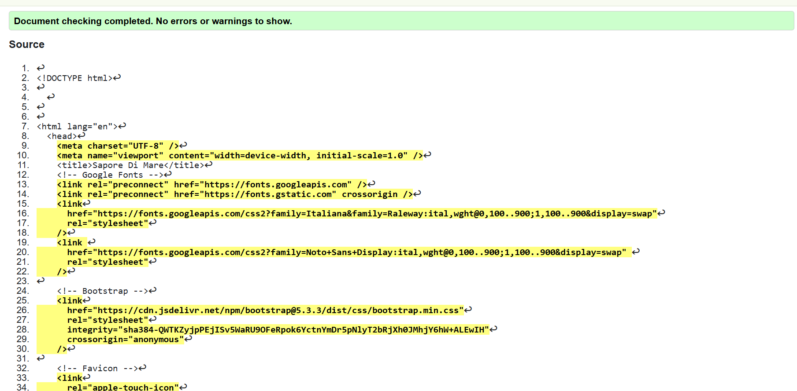

# Sapore di Mare Testing

As each section or Function/Model was built during this project, I was testing for functionality and styling issues that may have arisen (see table below), which were corrected or fixed before continuing. I also had friends test the site by signing up, adding and deleting comments using various devices on varying platforms (IOS, Android, Mobile, Tablet etc) and reporting back any issues they encountered with functionality or styling.

### Automated Testing

For this project, automated tests were implemented using **Django’s built-in TestCase** framework.  
The tests focus on the `Reservation` model and the `get_available_tables` utility function to ensure that the booking system behaves correctly in different scenarios.  

- **ReservationModelTest**  
  - Verifies that a reservation can be successfully created with a table, date, time, and number of guests.  
  - Ensures that the data saved in the database matches the expected values (e.g., reservation name and assigned table).  

- **UtilsTest**  
  - **test_available_table_when_free**: Confirms that tables with no reservations are returned as available when queried for a specific date and time.  
  - **test_unavailable_when_reserved**: Ensures that once a table is reserved at a given time, it no longer appears in the list of available tables, while other free tables remain available.  

These tests validate the **core booking logic** of the system: preventing overlapping reservations and correctly filtering tables based on their availability. They can be executed with the command:

```bash
python manage.py test booking


## Manual Testing

| TEST | OUTCOME | PASS/FAIL|
|:---:|:---:|:---:|
| General | Index page fully renders with all content visible | Pass |
| General | All links routed to correct pages | Pass |
| General | Menu page fully renders with all content visible | Pass |
| General | Navbar menu collapses to dropdown on small screens | Pass |
| General | latest version deployed to Heroku | Pass |
| Access | Users able to login with username and email | Pass |
| Access | User given feedback as to if they are logged in or not | Pass |
| Access | Log in feedback links to register and log in pages | Pass |
| Access | Users unable to access admin page without proper permissions | Pass |
| Reservations | Reservations only visible when logged in | Pass |
| Reservations | User can only view reservations they have made | Pass |
| Reservations | Logged in user can make a reservation | Pass |
| Reservations | Logged in user can edit a reservation | Pass |
| Reservations | Logged in user cannot access other users reservation using the id in the url| Pass |
| Reservations | Logged in user that tried to access other users reservation using the id in the url, are redirected to the homepage and error message is shown | Pass |
| Reservations | Logged in user can delete a reservation | Pass |
| Reservations | Logged in staff/superuser can make a reservation | Pass |
| Reservations | Logged in staff/superuser can edit a reservation | Pass |
| Reservations | Logged in staff/superuser can delete a reservation | Pass |
| Reservations | Datepicker prevents user booking date prior to current date| Pass |
| Reservations | Reservation form cannot be submitted without all fields being completed | Pass |
| Menu | Menu list page fully renders all content to correct sections | Pass |
| Menu | Menu page fully renders all content to correct sections | Pass |
| Menu | Logged in staff/superuser can add menu items | Pass |
| Menu | Logged in staff/superuser can edit menu items | Pass |
| Menu | Logged in staff/superuser can delete menu items | Pass | 
| Menu | Menu items can only be created, edited and deleted through admin panel | Pass |


## Lighthouse

Website was tested in dev tools using Lightouse:


## Validation Testing


### HTML & CSS


HTML & CSS testing was completed using [W3 Validator](https://validator.w3.org/)

HTML validation is done using the website pages source code, and showed no errors when testing:



CSS was validated with no errors:


## Python Testing


Python pep8 validation was done via [Code Institute's Python Linter](https://pep8ci.herokuapp.com/)


Python files validated are, models, views, urls and form.

